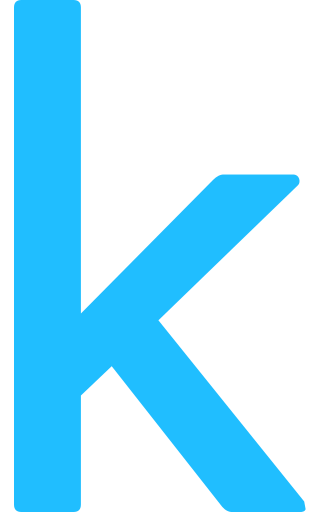
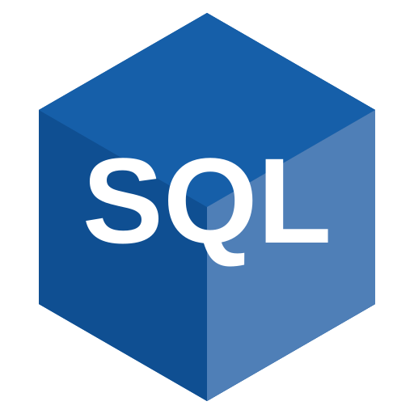
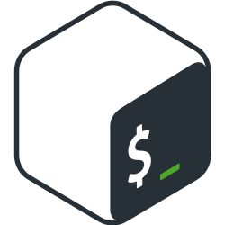
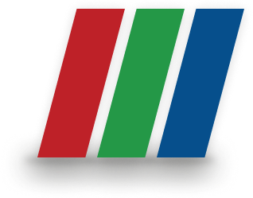
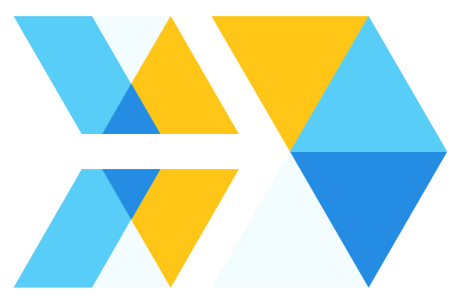
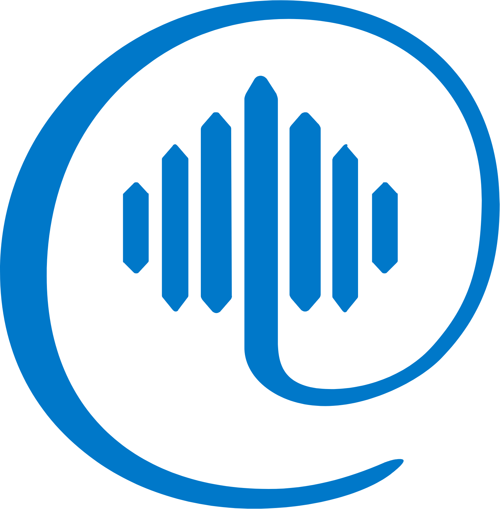
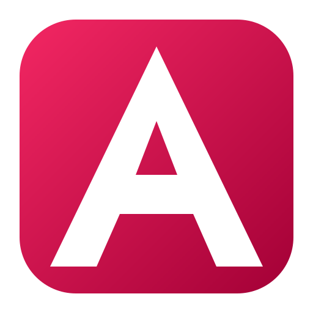
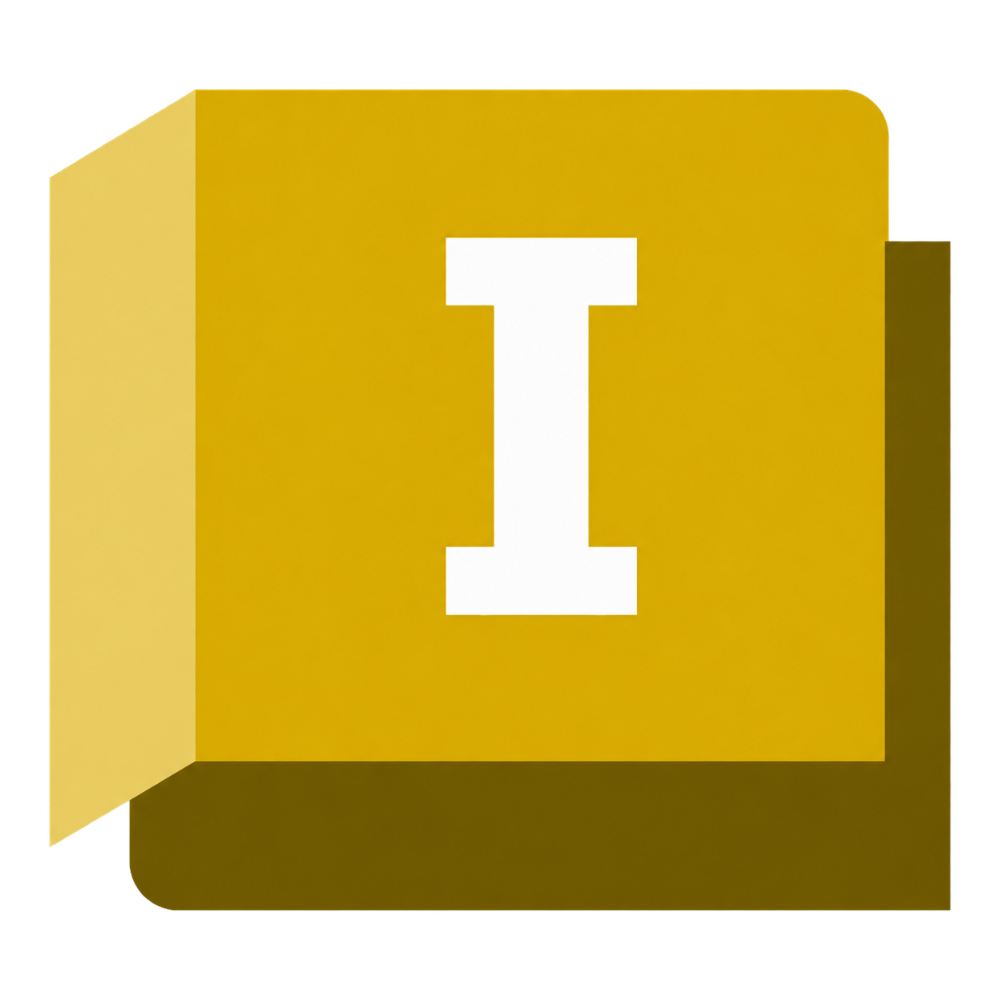

<!-- GitHub profile README for github.com/gcalpay -->

## Connect with me

Anyone is welcome to write to me, regardless of personal background, career stage or age. I am happy to connect, chat and exchange ideas about engineering, research, open source software or anything else we may find interesting. I am also open to work opportunities, research collaborations and open source contributions.

  &nbsp;&nbsp;
  &nbsp;&nbsp;
  <a href="https://x.com/cemgineer"><picture><source media="(prefers-color-scheme: dark)" srcset="https://cdn.simpleicons.org/x/FFFFFF"></picture></a>&nbsp;&nbsp;
  &nbsp;&nbsp;
  &nbsp;&nbsp;
<!--  &nbsp;&nbsp; -->
 <!-- &nbsp;&nbsp; -->
  

## About me

My work focuses on chemical process simulation, thermodynamics and energy systems, particularly heat-engine modeling and energy recovery from waste heat and cryogenic sources. I also work with CFD and multiphysics simulation, scientific computing and thermodynamics-informed machine learning.

## Featured repository

<table>
<tr>
<td>

### [Carnopy](https://github.com/gcalpay/carnopy)

Reproducible thermophysical data pipelines integrating property models and simulation backends, with inspection, visualization, provenance and leakage aware preparation for machine learning workflows.

</td>
</tr>
</table>

## Other current projects

- **Pinntropy** · Thermodynamics-informed machine learning for surrogate modeling with physical constraints, exploring different ways to embed physical structure in model architectures, loss functions and optimization algorithms, with phase aware modeling and validity domain assessment *(private repo · license undecided)*

- **qSink** · Engineering decision support for industrial waste heat and cold energy recovery, currently focused on Hamburg, Germany. It covers heat pumps, local heat use, cold conversion, power generation (ORC, TFC, Kalina, TEGs etc), thermal/electrical storage and integration with heating/cooling networks and the power grid. *(private repo · license undecided)*

- **gmawFoam** · OpenFOAM development for coupled electromagnetic, thermal and fluid flow modeling of GMAW (MIG/MAG). *(private repo · GPL-3.0)*
<!---## Education and qualifications

 **M.Eng. in Process Simulation** - Wilhelm Büchner University of Applied Sciences, Darmstadt, 2023
- **International Welding Engineer (IWE)** - Welding Training and Research Institute North (SLV Nord), 2020
- **B.Sc. in Process Engineering**, specialization in Process and Plant Engineering - Hamburg University of Applied Sciences, 2018

My **B.Sc. thesis** about thermoeconomic assessment of ORC for a German LNG terminal was conducted in cooperation with **Umwelttechnik & Ingenieure GmbH, Hannover**, and my **M.Eng. thesis** about Lignin as substitute for Phenol in phenolic resins with **Resopal GmbH, Darmstadt**. Both were completed under NDA and are therefore not publicly available. -->

## Software stack

### Programming languages and development

  &nbsp;
  &nbsp;
<!--  &nbsp; -->
  &nbsp;
  &nbsp;
  &nbsp;
  &nbsp;
  &nbsp;
  

### Scientific computing, data analysis and visualization

  &nbsp;
  &nbsp;
  &nbsp;
  &nbsp;
  &nbsp;
  &nbsp;
<!--  &nbsp;-->
  &nbsp;
  &nbsp;
  &nbsp;
  &nbsp;
  

### Machine learning and physics-informed ML

  &nbsp;
  &nbsp;
  &nbsp;
  &nbsp;
  &nbsp;
  &nbsp;
  

### Engineering and simulation software

  &nbsp;
  &nbsp;
  &nbsp;
  &nbsp;
  &nbsp;
  &nbsp;
  &nbsp;
  &nbsp;
  &nbsp;
  

